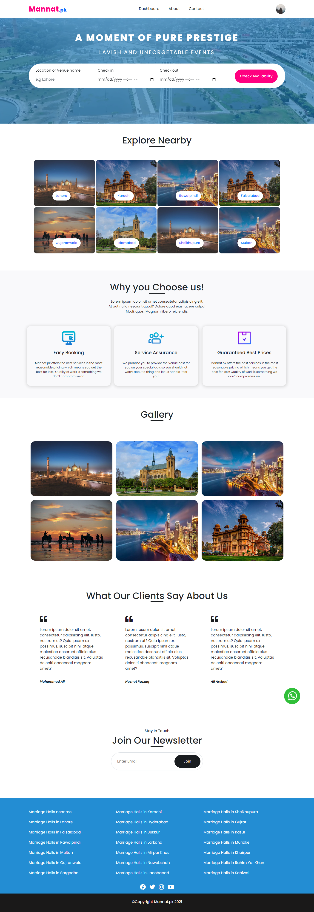

# My Django Portfolio Project

## Description

Mannat.pk is Hotel and Marriage Halls Booking Management CMS7
It model consists of 3 user type

1. Customer
2. Hall Manager
3. Admin

The customer send booking request to book a hotel on a specific date and time and the hall manager and admin have the rights to approve his/her request.

## Table of Contents

- [Installation](#installation)
- [Features](#features)
- [Technologies Used](#technologies-used)
- [Screenshots](#screenshots)
- [Contributing](#contributing)
- [License](#license)

## Installation

1. Make sure you have Python and Django installed. If not, you can download Python from <https://www.python.org/> and install Django using pip:

```
pip install django
```

2. Clone the repository to your local machine:

```
git clone https://github.com/fatimarazzaq/hotel_booking_CMS.git
```

3. Navigate to the project directory:

```
cd hotelProject
```

4. Install the required dependencies:

```
pip install -r requirements.txt
```

5. Apply database migrations:

```
python manage.py migrate
```

6. Run the development server:

```
python manage.py runserver
```

8. Access the application in your web browser at <http://localhost:8000/>

## Features

- Responsive and user-friendly interface.
- Project details and skillset management through the Django admin panel.
- Contact form for users to send messages directly to my email.
- Interactive UI elements and smooth navigation.

## Technologies Used

- Django: A high-level Python web framework
- HTML, CSS, JavaScript: Frontend development
- SQLite: Database
- Bootstrap: Frontend framework for responsive design
- Font Awesome: Fontawesome

## Screenshots



## Contributing

Contributions are welcome! If you find any issues or have suggestions for improvement, feel free to open an issue or submit a pull request.
